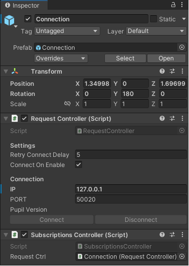
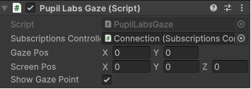
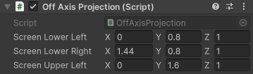
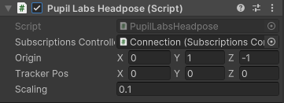

# Gaze- and head-contingent simulation in Unity
Unity scripts for the publication ["Using mobile eye tracking for gaze- and head-contingent vision simulations"](https://doi.org/10.1145/3649902.3655660)

Cite as:
```
Sauer, Y., Severitt, B., Agarwala, R., & Wahl, S. (2024).
Using mobile eye tracking for gaze- and head-contingent vision simulations.
In Proceedings of the 2024 Symposium on Eye Tracking Research and Applications (pp. 1-3).
```

## Requirements
Add the [PupilLabs hmd-eyes](https://github.com/pupil-labs/hmd-eyes) package to your Unity project. Then add the Connection prefab to your scene. Adjust the IP address for the computer running PupilCore. Activate network API, surface mapping, and head pose estimation plugins in PupilCore.




## Gaze mapping
The [PupilLabsGaze](./PupilLabsGaze.cs) script automatically retrieves gaze from PupilLabs surface mapping and converts the relative screen coordinates into a gaze ray in Unity world coordinates. To show the current gaze position, add a GameObject "GazePoint" to your scene, which will be placed at the current gaze location automatically.



## Off-axis projection

The [OffAxisProjection](./OffAxisProjection.cs) script controls the projection of the virtual camera. The projection properties are continuously adjusted for a view frustum through the corners of the virtual screen. Three corners of the screen have to be defined in virtual coordinates, which should fit the height and size of the real screen used for the simulation. The off-axis projection uses only the camera position and therefore works independently of PupilLabs head tracking. 



The position of the camera is updated with [PupilLabsHeadpose](./PupilLabsHeadpose.cs) script. Attach it to the object that should be tracked (usually the main camera). Vector3 Origin is the origin of the tracking coordinate system and depends on the april tag positions. Scaling should be adjusted to compensate for potential scaling offesets between Pupil Labs tracking and Unity position.



